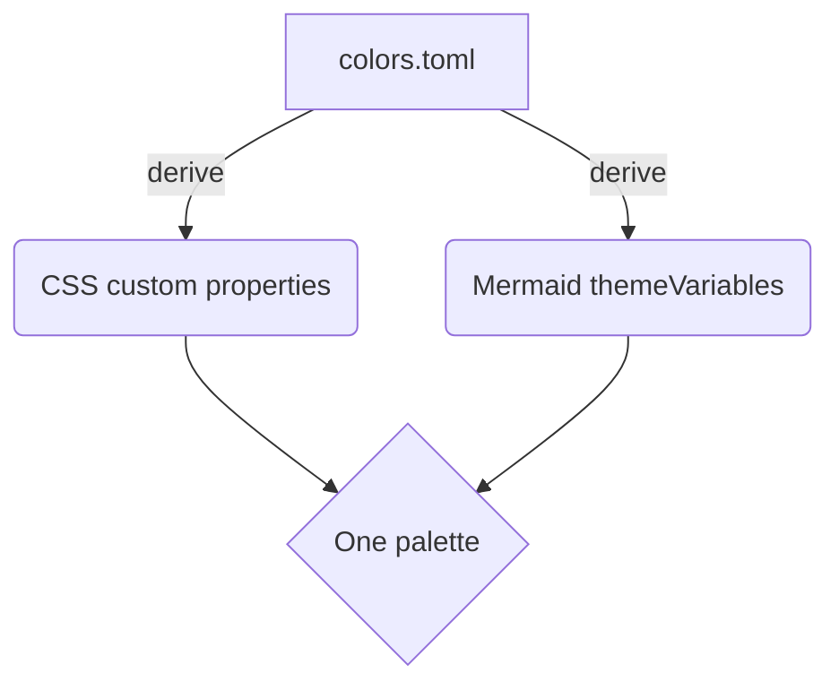
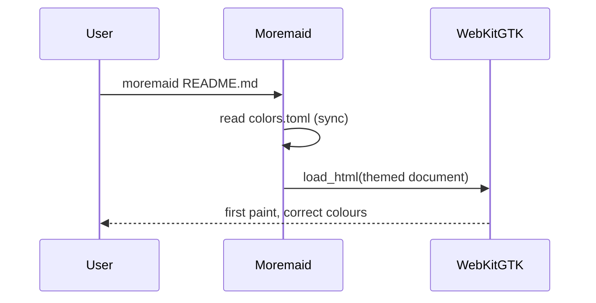

# Moremaid demo document

A quick exercise of everything Milestone 1 renders.

## Prose

Regular paragraph with **bold**, *italic*, ~~strikethrough~~, `inline code`,
and a [link to the handoff](https://github.com/thieso2/MoremaidApp).

> A blockquote with the accent-coloured edge from the Omarchy palette.

- [x] task list item, done
- [ ] task list item, pending

## A table

| role | source key |
|---|---|
| page background | `background` |
| links | `accent` |

## Code

```rust
fn main() {
    let palette = Palette::load(true);
    println!("mode: {}", if palette.dark { "dark" } else { "light" });
}
```

```python
def slugify(s: str) -> str:
    """Matches the JS slugify byte for byte."""
    return re.sub(r"\s+", "-", s.lower())
```

## Diagrams





## Duplicate heading

### Slugs

### Slugs

Two headings named "Slugs" — the second gets `-1` suffixed.
